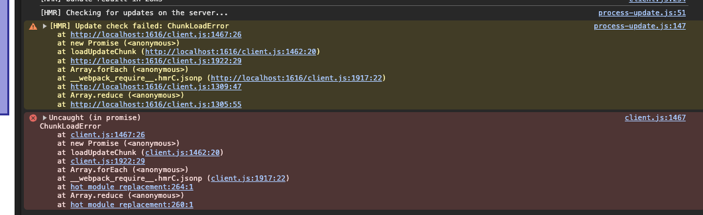

# Webpack Hot Middleware Example

* Install deps
```
npm install
```

* Start server
```sh
npm start
```
* Open page in browser http://localhost:1616
* Open the developer console
* Edit `client.js` or `extra.js` and edit this line

```js
document.getElementById('change').innerHTML = 'test'
```

Changing the value `test` with any value you like.

* Save the changes and check the console, there should be an error like this



Even though there's an error, the change was applied.

Now try making a change in the other file, for example if you changed `client.js` now change `extra.js`

Any change made to the other file won't work. Only the ones made to the first file.


**Why is this happening?**

The problem is that both files have this function defined:

```
self["webpackHotUpdate_my_library"] = (chunkId, moreModules, runtime) => { /** ... */}
```

And when applying updates, one of the function gets overriden by the other one, and only one of the files will work.


**Proposal/Fix**

To test a fix, run `npm run patch-webpack` and run the same steps as before, but now you should see everything working.


The current patch/approach is a really simple way to verify the theory of why it was failing.

Inside the folder `patches` there's a patch for webpack, applying some changes to `lib/javascript/ArrayPushCallbackChunkFormatPlugin.js` so `hotUpdateGlobal` uses the `-${chunk.id}` as a suffix, and also `lib/web/JsonpChunkLoadingRuntimeModule.js` so the call to that function is synchronized and it also uses the suffix `-${chunk.id}`.

I would like to open a PR to fix this problem, but I'm just asking for a little bit of guidance of how this modification to `hotUpdateGlobal` could be done [here](https://github.com/webpack/webpack/blob/1012ed854681d8c3d10740143378210966aa9816/lib/config/defaults.js#L969) instead. Maybe by using something like `[name]` or `[id]` in the config?

